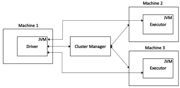

### 1.2.4 아파치 스파크 클러스터 아키텍처

##### 일반적인 아파치 스파크 클러스터는 Driver, 몇 가지 Executor 및 Cluster Manager의 세 가지 주요 구성 요소로 구성됩니다.

##### 

##### 이러한 각 구성 요소를 조금 더 자세히 살펴보겠습니다.

##### 1. Spark 애플리케이션의 핵심 구동

##### Spark Driver는 자바 가상 머신 프로세스이며, 스파크 애플리케이션의 핵심 부분입니다. RDD, DataFrame 및 데이터 세트 생성과 함께 사용자 애플리케이션 코드 선언을 담당합니다. 또한 Executor에서 코드를 조정 및 실행하고 Executor에서 작업을 생성 및 예약하는 일을 담당합니다. 만일 실행이 실패 후, Executor를 다시 시작하고 최종적으로 요청된 모든 데이터를 클라이언트나 사용자에게 반환하는 책임도 있습니다. Spark 드라이버를 모든 스파크 응용 프로그램의 main() 프로그램으로 생각하면 됩니다. 

***중요 사항***
##### 드라이버는 스파크 클러스터의 단일 실패 지점이며 드라이버가 실패하면 전체 스파크 애플리케이션이 실패합니다. 따라서 서로 다른 클러스터 관리자는 드라이버를 고가용성으로 만들기 위해 서로 다른 전략을 구현합니다.

##### 2. 실제 워커를 동작하는 Executor 

##### Spark Executor는 자바 가상 머신 프로세스이기도 하며 실제로 데이터를 변환하는 RDD에서 실행 작업을 담당합니다. 데이터 파티션을 로컬로 캐시하고 처리된 데이터를 다시 드라이버로 반환하거나 영구 저장소에 쓸 수 있습니다. 각 Executor는 병렬로 RDD의 파티션 세트에서 작업을 실행합니다.

##### 3. 클러스터 관리자는 클러스터 리소스를 조정하고 관리합니다.

##### 클러스터 관리자는 클러스터에서 중앙에서 실행되는 프로세스이며 드라이버가 요청한 리소스를 제공하는 역할을 합니다. 또한 작업 진행 상황 및 상태와 관련하여 Executor를 모니터링합니다. 아파치 스파크는 독립형 클러스터 관리자라고 하는 자체 클러스터 관리자와 함께 제공되지만 YARN 또는 Mesos와 같은 다른 인기 있는 클러스터 관리자도 지원합니다. 대부분 스파크에 내장된 독립 실행형 클러스터 관리자를 사용한다. 
