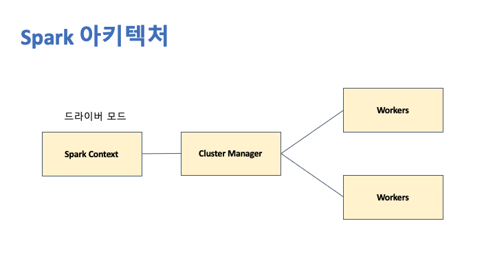

# Spark

#### 그 동안 Spark로 데이터 레이크 및 SparkML 머신러닝 프로젝트했던 경험 노하우와 소스파일, 설치 방법등을 공개합니다. 
#### 먼저 아파치 스파크(Apache Spark)에 대해 알아보면, 빠르고 범용적인 클러스터 컴퓨팅 시스템을 말합니다. Java, Scala, Python, R의 고수준 API와 표준적인 실행 그래프를 지원하는 최적화된 엔진을 제공합니다. 또한 SQL과 같은 구조화된 데이터 처리를 위한 Spark SQL, 머신 러닝을 위한 MLlib, 그래프 처리를 위한 GraphX, 스파크 스트리밍을 포함한 고급 도구 셋등을 풍부하게 지원합니다.

## 1. 개요
####  1) 스파크는 로컬 PC, Amazon EMR Custer 상에서 Notebook Instance 그리고 최근에 Spark on Kubernetes (EKS)에서 설치와 개발, 실행, 모니터링이 가능합니다.  
####  2) 주의사항: 로컬 PC에서는 3가지 프레임워크 버전이 맞아야 합니다. 현재 저는 Anaconda 3 환경에서 Python 3.8 과 Java 8 version, 그리고 Spark 3.1.2 / Hadoop 2.7 버전을 사용하고 있습니다. 자세한 설치 가이드는 현재 작성 중에 있으니 완성되면 공유하도록 하겠습니다.
####  3) 로컬 PC 시스템과 클라우드 실행 차이점: 로컬과 클라우드에서 Spark 실행은 거의 모두 동일하나 파일을 불러 올때 Path 와 불러올 때 함수가 차이가 납니다. 그외 RDD, SparkSQL, Spark DataFrame, SparkML (MLib)은 동일합니다.
####  

## 2. 아키텍처 

### 

#### 높은 수준에서 모든 Spark 애플리케이션은 사용자의 주요 기능을 실행하고 클러스터에서 다양한 병렬 작업을 실행하는 드라이버 프로그램으로 구성됩니다. Spark가 제공하는 주요 추상화는 병렬로 작동할 수 있는 클러스터의 노드에 걸쳐 분할된 요소 모음인 탄력적인 분산 데이터셋(RDD, Resilient Distrubuted Datasets)입니다. RDD는 Hadoop 파일 시스템(또는 다른 Hadoop 지원 파일 시스템)의 파일 또는 드라이버 프로그램의 기존 Scala 컬렉션으로 시작하여 변환하여 생성합니다. 
#### 이때 사용자는 Spark에 RDD를 메모리에 유지하도록 요청할 수도 있으므로 병렬 작업에서 효율적으로 재사용할 수 있습니다. 마지막으로 RDD는 노드 장애로부터 자동으로 복구됩니다. Spark의 두 번째 추상화는 병렬 작업에서 사용할 수 있는 공유 변수(Shared Variables)입니다. 
#### 기본적으로 Spark가 다른 노드에서 일련의 태스크로 함수를 병렬로 실행할 때 함수에 사용된 각 변수의 복사본을 각 태스크에 전달합니다. 경우에 따라 태스크 간에 또는 태스크들과 드라이버 프로그램 간에 변수를 공유해야 합니다. Spark는 두 가지 유형의 공유 변수를 지원하는 데, 모든 노드의 메모리에 값을 캐시하는 데 사용할 수 있는 브로드캐스트 변수(Broadcast Variables)와 카운터(counter)나 합계(sum)와 같이 "추가"만 되는 변수인 accumulator variable 입니다.

## 3. 탄력적인 분산 데이터셋(RDD, Resilient Distrubuted Datasets)

#### RDD에 대해 좀더 자세히 설명하자면, Spark는 병렬로 작동할 수 있는 내결함성(fault-torelance) 콜렉션으로 탄력적인 분산 데이터셋(RDD) 중심으로 합니다. RDD를 생성하는 두 가지 방법이 있습니다. 드라이버 프로그램에서 기존 컬렉션을 병렬화하거나 공유 파일 시스템인 HDFS, HBase 또는 Hadoop InputFormat을 제공하는 모든 데이터 소스와 같은 외부 스토리지 시스템의 데이터셋을 참조하는 것입니다.

## 4. SQL, DataFrames 과 외부의 데이터셋

#### 3) 외부의 데이터셋들은 PySpark을 사용하여 로컬 파일 시스템, HDFS, Cassandra, HBase, Amazon S3 등을 포함하여 Hadoop이 지원하는 모든 스토리지 소스에서 분산 데이터셋을 생성할 수 있습니다. Spark는 텍스트 파일, SequenceFile 및 기타 Hadoop InputFormat을 지원합니다.

## 5. 구조적인 스트리밍 

#### 구조적인 스트리밍(Structured Streaming)은 Spark SQL 엔진에 구축된 확장 가능하고 내결함성이 있는 스트림 처리 엔진입니다. 정적 데이터에 대한 일괄 계산을 표현하는 것과 같은 방식으로 스트리밍 계산을 표현할 수 있습니다. Spark SQL 엔진은 점진적으로 지속적으로 실행하고 스트리밍 데이터가 계속 도착하면 최종 결과를 업데이트합니다. Scala, Java, Python 또는 R에서 Dataset/DataFrame API를 사용하여 스트리밍 집계, event-time Windows, stream-to-batch Joins 등을 표현할 수 있습니다. 계산은 동일한 최적화된 Spark SQL 엔진에서 실행됩니다. 마지막으로 시스템은 체크포인트 및 미리 쓰기 로그를 통해 종단 간 정확히 한 번 내결함성을 보장합니다. 간단히 말해서, 구조적인 스트리밍은 사용자가 스트리밍에 대해 생각할 필요 없이 빠르고 확장 가능하며 내결함성이 있는 종단 간 정확히 1회 스트림(exactly-once stream) 처리를 제공합니다.

#### 내부적으로 구조적 스트리밍 질의는 마이크로 배치 처리 엔진을 사용하여 처리합니다. 이 엔진은 데이터 스트림을 일련의 작은 배치 작업으로 처리하여 100밀리초만큼 짧은 종단 간 대기 시간과 정확히 1회의 내결함성을 보장합니다. 그러나 Spark 2.3부터 연속 처리(Continuous Processing)라고 하는 새로운 저지연(low-latency) 처리 모드를 도입했습니다. 사용자가 실행하는 질의에서 Dataset/DataFrame 동작을 변경하지 않고도 애플리케이션 요구 사항에 따라 모드를 선택할 수 있습니다.

## 6. 스파크 스트리밍 

#### 스파크 스트리밍(Spark Streaming, DStreams)은 라이브 데이터 스트림의 확장 가능하고 처리량이 높으며 내결함성이 있는 스트림 처리를 가능하게 하는 핵심적인 Spark API의 확장입니다. 데이터는 Kafka, Kinesis 또는 TCP 소켓과 같은 많은 소스에서 수집할 수 있으며, map, reduce, join 및 windows과 같은 고급 기능으로 표현된 복잡한 알고리즘을 사용하여 처리할 수 있습니다. 마지막으로 처리된 데이터를 파일 시스템, 데이터베이스 및 라이브 대시보드로 푸시할 수 있습니다. 실제로 Spark의 머신러닝 및 그래프 처리 알고리즘을 데이터 스트림에 적용할 수 있습니다.

#### 

## 7. MLib (머신러닝)

#### MLlib는 Spark의 머신러닝(ML) 라이브러리입니다. 이 라이브러리의 목표는 실용적인 머신러닝을 확장 가능하고 쉽게 만드는 것입니다. 고수준에서 다음과 같은 도구를 제공합니다.

#### * ML 알고리즘: 분류, 회귀, 클러스터링 및 협업 필터링과 같은 일반적인 학습 알고리즘
#### * 피쳐: 피쳐 추출, 변환, 차원 축소 및 선택
#### * 파이프라인: ML 파이프라인을 구성, 평가 및 튜닝하기 위한 도구
#### * 지속성: 알고리즘, 모델 및 파이프라인 저장 및 로드
#### * 유틸리티: 선형 대수학, 통계, 데이터 처리 등

#### MLlib의 RDD 기반 API는 이제 유지관리 모드에 있습니다. Spark 2.0부터 spark.mllib 패키지의 RDD 기반 API가 유지 관리 모드에 들어갔습니다. Spark용 기본 Machine Learning API는 이제 spark.ml 패키지의 DataFrame 기반 API입니다. 그 이유는 MLlib는 버그 수정과 함께 spark.mllib에서 RDD 기반 API를 계속 지원하기 때문입니다. 따라서 더 이상 MLlib는 RDD 기반 API에 새로운 기능을 추가하지 않습니다.참고로 Spark 2.x 릴리스에서 MLlib는 DataFrames 기반 API에 기능을 추가하여 RDD 기반 API와 기능 패리티에 유사합니다.

### 1) MLlib가 DataFrame 기반 API로 전환하는 이유는 무엇입니까?

#### DataFrame은 RDD보다 사용자 친화적인 API를 제공합니다. DataFrames의 많은 이점에는 Spark Datasources, SQL/DataFrame 질의, Tungsten 및 Catalyst 최적화, 언어 간 균일한 API 등이 있습니다.
MLlib용 DataFrame 기반 API는 ML 알고리즘과 여러 언어에서 균일한 API를 제공합니다. DataFrame은 실용적인 ML 파이프라인, 특히 기능 변환을 용이하게 합니다.  

### 2) "스파크 ML"이란 무엇입니까?

#### "Spark ML"은 공식 명칭은 아니지만 가끔 MLlib DataFrame 기반 API를 지칭하는 데 사용됩니다. 이는 주로 DataFrame 기반 API에서 사용하는 org.apache.spark.ml Scala 패키지 이름과 초기에 파이프라인 개념을 강조하기 위해 사용한 "Spark ML Pipelines" 용어 때문입니다.

#### 3) MLlib가 더 이상 사용되지 않습니까?

#### 그렇지 않습니다. MLlib에는 RDD 기반 API와 DataFrame 기반 API가 모두 포함되어 있습니다. RDD 기반 API는 이제 유지관리 모드만 사용하고 더 이상 최신 API도 더 이상 사용되지 않으며 MLlib도 전체적으로 사용되지 않을 뿐입니다. 

